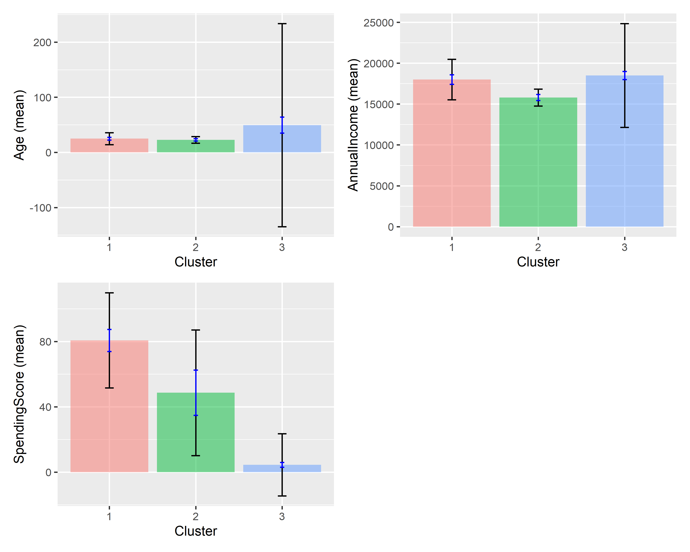

## Interactive Business Analytics Dashboard

{fig-align="center" width="100%"}

------------------------------------------------------------------------

## Presentation Outline

1.  What is Interactive Business Analytics?
2.  Traditional vs Interactive Analytics
3.  Introduction to Radiant
4.  The Shiny Framework
5.  Live Demo: Customer Segmentation
6.  Building Custom Apps & Summary

------------------------------------------------------------------------

## What is Interactive Business Analytics? {.smaller}

**Definition:** Dynamic tools that allow business users to explore data, change parameters, and see results in real time.

::::: columns
::: {.column width="50%"}
**Real-Time Responsiveness**

- Adjust a slider - plot updates instantly
- No waiting, no refresh button
- Immediate visual feedback

**User-Driven Exploration**

- Users control what they see
- Ask their own questions
- Discover patterns themselves
:::

::: {.column width="50%"}
**Accessibility**

- Point-and-click interface
- No coding required
- Reduces dependency on analysts

**Reproducibility**

- All actions generate underlying R code
- Results can be verified and repeated
- Decisions are documented
:::
:::::

------------------------------------------------------------------------

## Traditional vs Interactive Analytics {.smaller}

| Feature       | Traditional (Static)   | Interactive (Dynamic)   |
|---------------|------------------------|-------------------------|
| Who explores? | Analyst creates report | User explores directly  |
| Parameters    | Fixed                  | Adjustable in real time |
| Turnaround    | Days / hours           | Instant                 |
| Insights      | One-time               | Continuous              |

**Why does this matter?**

- **Speed:** No waiting for analyst reports
- **Exploration:** Users answer their own questions
- **Scenarios:** Test multiple "what-if" situations
- **Democratisation:** Analytics for everyone

------------------------------------------------------------------------

## What is Radiant? {.smaller}

> Radiant is a platform-independent, browser-based interface for business analytics in R.

::::: columns
::: {.column width="50%"}
**Key Features**

- **Data:** Import, view, transform
- **Basics:** Explore, visualise
- **Model:** Regression, prediction
- **Multivariate:** Clustering, PCA
- **Report:** Export reproducible output

**Installing and Launching**

```{r}
#| eval: false
#| echo: true

install.packages("radiant")
library(radiant)
radiant()
```
:::

::: {.column width="50%"}
**Why Radiant?**

- Built on R analytics + Shiny interactivity
- Point-and-click, no coding required
- Generates reproducible R code automatically
- Free and open-source
- Runs in any browser
:::
:::::

------------------------------------------------------------------------

## The Shiny Framework {.smaller}

> Shiny is an R framework for building interactive web applications.

**Core concept: Reactive Programming** - outputs automatically update when inputs change.

```{r}
#| eval: false
#| echo: true

library(shiny)

ui <- fluidPage(
  sliderInput("threshold", "Sales Threshold:",
              min = 0, max = 100000, value = 50000),
  plotOutput("salesPlot")
)

server <- function(input, output) {
  output$salesPlot <- renderPlot({
    # Reacts automatically when input$threshold changes
  })
}

shinyApp(ui = ui, server = server)
```

- `ui` - controls what the user **sees**
- `server` - controls how the app **responds**
- `shinyApp()` - combines both parts

------------------------------------------------------------------------

## Demo: Customer Segmentation Setup {.smaller}

**Business question:** How can we segment customers by age, income, and spending behaviour?

**Step 1 - Launch Radiant**

```{r}
#| eval: false
#| echo: true

library(radiant)
radiant()
```

**Step 2 - Load data:** Data → Manage → Load data → select `customer_data.csv` → click **Load**

**Step 3 - Verify dataset:** Data → View → confirm columns are present:

| Age | AnnualIncome | SpendingScore |
|-----|--------------|---------------|
| 19  | 15000        | 39            |
| 21  | 15000        | 81            |

------------------------------------------------------------------------

## Demo: Running the Analysis {.smaller}

**Step 4-5 - Configure K-Means Clustering**

Multivariate → Cluster → select variables: **Age, AnnualIncome, SpendingScore** → Method: **K-means** → k = **3** → click **Estimate**

**Step 6 - Observe the interactive output**

After running, Radiant displays:

- Cluster results table
- Cluster sizes and means
- Visual plots
- Summary statistics

> This is Shiny's reactivity in action; change k from 3 to 4 and all outputs update instantly.

------------------------------------------------------------------------

## Interpreting the Customer Segments {.smaller}

:::::: columns
::: {.column width="33%"}
**Segment 1** High-Value Customers

- High income
- High spending score

*Strong purchasing power, already highly engaged. Priority for loyalty programmes.*
:::

::: {.column width="33%"}
**Segment 2** Budget-Conscious Customers

- Lower income
- Lower/moderate spending

*Price-sensitive group. Respond well to discounts and value-for-money offers.*
:::

::: {.column width="33%"}
**Segment 3** Growth Potential Customers

- Good income
- Lower spending score

*Ability to spend more but not yet engaged. Target with personalised campaigns.*
:::
::::::

------------------------------------------------------------------------

## Building Custom Shiny Apps {.smaller}

**Why go beyond Radiant?**

- Specific business workflows
- Company branding and databases
- Complex multi-step logic
- User-friendly interfaces for non-R users

**Deployment Options**

| Platform        | Best For                     | Cost                |
|-----------------|------------------------------|---------------------|
| shinyapps.io    | Quick prototypes and sharing | Free tier available |
| Shiny Server    | Internal company use         | Free (open source)  |
| RStudio Connect | Enterprise deployment        | Commercial          |

> Radiant gives you the interface. Shiny gives you the freedom to build your own.

------------------------------------------------------------------------

## Class Exercise {.smaller}

**Question:**

> Which R package would you use first to create an interactive business analytics dashboard: Radiant or Shiny and why?

**Think about:**

- Ease of use vs customisation
- Business purpose vs technical flexibility
- Who is the end user?
- What does your organisation already know?

*There is no single correct answer. The goal is to justify your choice.*

------------------------------------------------------------------------

## Summary {.smaller}

::::: columns
::: {.column width="50%"}
**Key Takeaways**

- Interactive analytics empowers users to explore data without coding
- **Radiant** = R + Shiny, packaged as a business analytics interface
- **Shiny** = the reactive framework that powers Radiant and custom apps
- Customer segmentation is a practical, high-value application
- Both tools are free, open-source, and run in the browser
:::

::: {.column width="45%"}
**The Core Relationship**

```{r}
#| eval: false
#| echo: true

# R
#  └── Shiny (reactive web framework)
#      └── Radiant (business analytics UI)
#          └── Your Custom Apps
```

*Start with Radiant. Build with Shiny.*
:::
:::::

------------------------------------------------------------------------

## References {.smaller}

::: {#refs}
:::

------------------------------------------------------------------------

## Thank You {.center}

